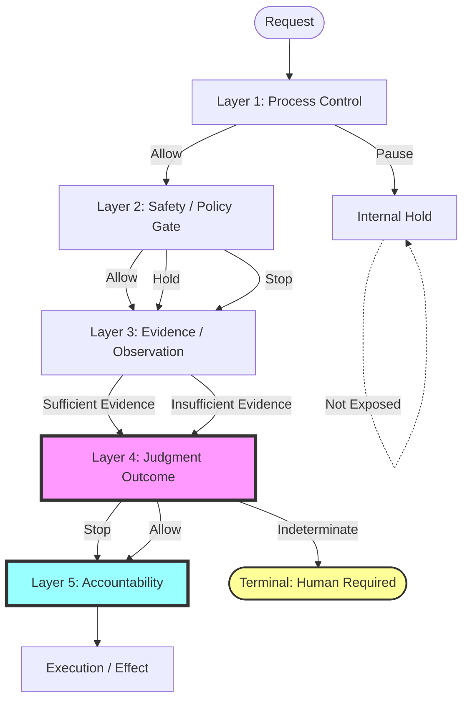
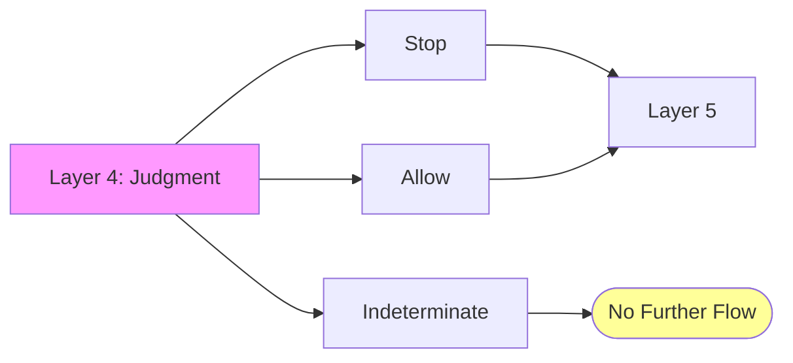
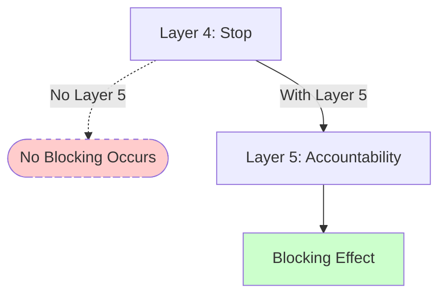
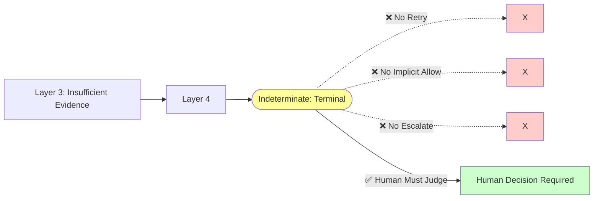
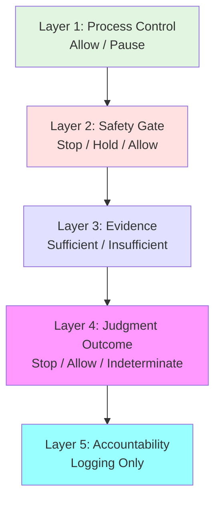
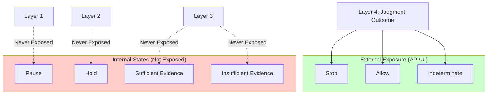

# AJT Judgment Flow Demo

**Status**: Non-normative / Educational visualization

This repository demonstrates AJT (Audit Judgment Trail) judgment flow through visual diagrams.

**This is NOT a constitutional document.** For normative rules, see:
- [AJT Layer Architecture (Constitutional)](https://github.com/Nick-heo-eg/cognitive-infrastructure-constitution/blob/main/judgment/AJT_LAYER_ARCHITECTURE.md)

---

## Purpose

AJT is not a rule table. It is a flowing structure.

**This visualization shows:**
- How judgment traces move through 5 layers
- Where judgment and accountability separate
- Why Indeterminate is a terminal state
- What happens when Layer 5 is absent

**The key insight:**
> A judgment that doesn't reach Layer 5 (Accountability) has no effect on reality.

---

## Basic Flow Diagram

---

## Key Visualization Principles

### 1. Layer 4 is the Branching Point

**What this shows:**
- Stop/Allow continue to Layer 5
- Indeterminate terminates immediately
- No automatic retry from Indeterminate

---

### 2. Judgment Without Accountability Has No Effect

**What this shows:**
- A Stop judgment alone does not block
- Layer 5 (Accountability) must execute
- If Layer 5 fails, the entire operation fails

---

### 3. Indeterminate is Complete, Not Incomplete

**What this shows:**
- Indeterminate is a formal judgment result
- It is terminal (no automatic continuation)
- Human intervention is required

---

### 4. State Language by Layer

**What this shows:**
- Each layer has fixed state language
- Hold appears only in Layer 1, 2
- Indeterminate appears only in Layer 4
- Layer 5 has no state language (logs only)

---

## External Exposure vs Internal States

**What this shows:**
- Only Layer 4 states are exposed externally
- Hold/Pause are internal only
- Users see only Stop/Allow/Indeterminate

---

## What This Visualization Is NOT

This repository does NOT contain:
- ❌ Constitutional rules
- ❌ Normative specifications
- ❌ Implementation requirements
- ❌ Executable code

This repository DOES contain:
- ✅ Educational diagrams
- ✅ Flow visualizations
- ✅ Conceptual demonstrations
- ✅ Teaching materials

---

## Constitutional Authority

All normative rules are defined in:
- [AJT Layer Architecture](https://github.com/Nick-heo-eg/cognitive-infrastructure-constitution/blob/main/judgment/AJT_LAYER_ARCHITECTURE.md)

If any visualization conflicts with the constitution, the constitution prevails.

---

## Related Resources

- [AJT Explanatory Docs](https://github.com/Nick-heo-eg/ajt-explanatory-docs) — Why judgment and accountability are separated
- [Judgment Experiment Logs](https://github.com/Nick-heo-eg/judgment-experiment-logs) — Case studies

---

## Future Enhancements

**Phase 2 (Planned):**
- Interactive D3.js animation showing token movement
- Step-by-step judgment trace visualization
- Layer-by-layer state transitions with timing

**Principle:**
> AJT is not a table to read. It is a flow to watch.

---

**Last Updated**: 2026-01-13
**Repository Type**: Non-normative educational visualization
